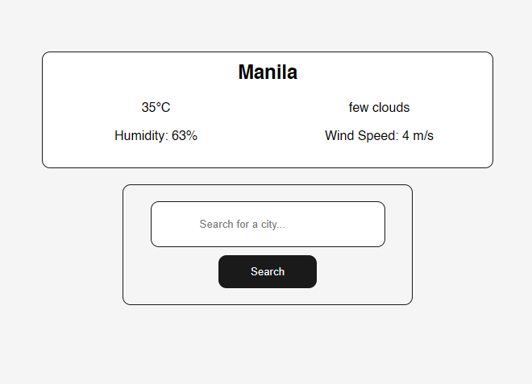

# weather-app

A minimal weather information display
board with a search bar for any city.

## Live Demo

[vClaudio11.github.io/weather-app](https://vClaudio11.github.io/weather-app)

## Screenshot



## Built With

- HTML5
- CSS3 — Flexbox, custom properties, display grid, backdrop filters and visible and hidden classes
- JavaScript — DOM manipulation, event listeners, objects, conditions, classList, asynchronous functions, await / fetch commands, API data rendering

## Features

- Displays weather information neatly
- Smooth UI and loading states
- Deployed and publicly accessible via GitHub Pages


## Getting Started

No installation needed. To run locally:

1. Clone the repository
```bash
git clone https://github.com/vclaudio11/weather-app.git
```
2. Open `index.html` in your browser

## Roadmap

- [ ] add more weather information to be displayed
- [ ] add more UI to look sleek
- [ ] gather predictive weather forecasts

## API Key Setup

This project uses the OpenWeatherMap API. The API key is included 
directly in the source for demonstration purposes as this is a 
student project using a free tier key.

## License

This project is open source and available under the 
[MIT License](LICENSE).